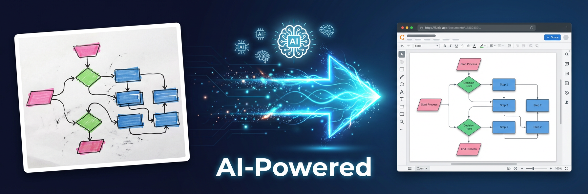
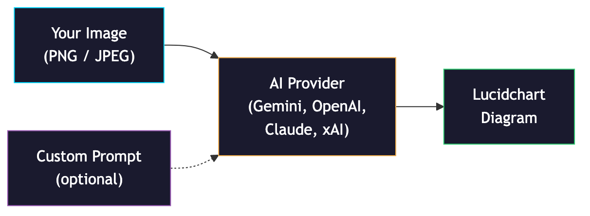
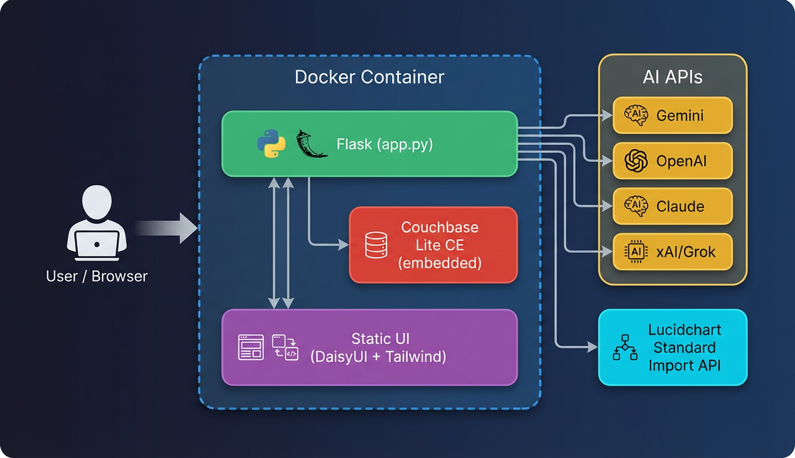
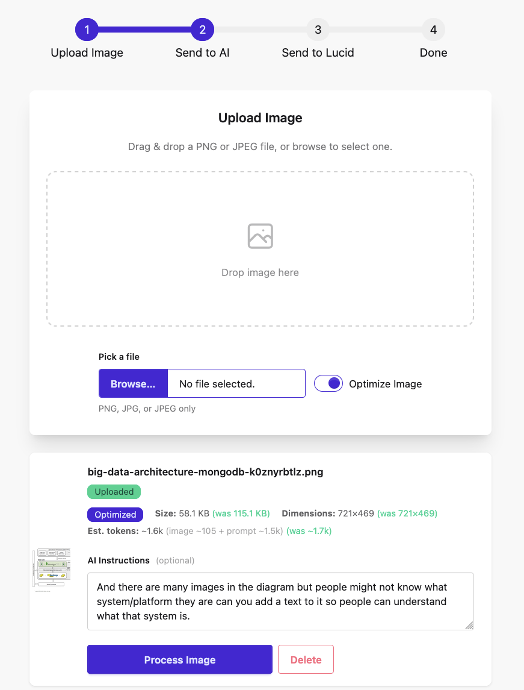

# Lucid v1.2.2



**Turn any image into an editable Lucidchart diagram — powered by AI, right from your browser.**


---

## The Problem

Did you:
- Take a picture of a whiteboard sketch
- Take a screenshot of an architecture/workflow diagram
- Snap a photo of a flowchart scribbled on paper
- Download architecture/workflow diagram image you want to emulate

AND you need it in Lucidchart?

### How You'd Normally Do It

Open Lucidchart, stare at your image, and manually recreate every box, arrow, and label one by one. :-/ 
- Tedious
- Error-prone
- Slow — especially for complex diagrams with dozens of shapes and connections

### How You'd Like to Do It

Import the image and have it **auto-magically** appear as an editable Lucidchart diagram — shapes, lines, containers, and all.

### This Project Does That — and More



Lucid takes your image, sends it to AI, and the AI converts it into a fully editable Lucidchart diagram automatically. But it doesn't stop there — you can also type a **custom prompt** to change, update, or enhance the diagram before it's created. Tell the AI things like *"Add a retry path between step 3 and step 1"*, *"Identify bottlenecks"*, or *"Remove the database layer"* and it adjusts the output accordingly.

---

## Architecture



---

## How to Use the Tool

### Quick Start

```bash
docker compose up --build
```

Open **http://localhost:8888**



### Step-by-Step

1. **Configure credentials** — Click the gear icon and enter your API keys for Lucidchart and at least one AI provider (Gemini, OpenAI, Claude, or xAI)
2. **Upload an image** — Drag and drop (or browse) a PNG or JPEG file
3. **Review metadata** — Check the image preview, dimensions, and estimated token cost
4. **Add a custom prompt (optional)** — Type natural-language instructions to guide the AI (e.g., *"Add a load balancer"*, *"Highlight the bottleneck"*)
5. **Process** — Select your AI provider and click Process. The step tracker shows progress: Upload → AI → Lucid → Done
6. **View your diagram** — Click the Lucidchart link to open your new editable diagram

---

## What It Can Do For You

### Multi-Provider AI
Choose from **Gemini**, **OpenAI (GPT-4o)**, **Claude**, or **xAI/Grok** — switch providers anytime from the Settings modal.

### Full Lucidchart Shape Support
Generates all Standard Import shape libraries (flowchart, containers, tables, swim lanes), 22 endpoint/line styles, groups, and layers — with automatic reference-integrity validation.

### Optimized Pipeline
Images are auto-downscaled and re-encoded before sending to AI. A step tracker (Upload → AI → Lucid → Done) shows progress, and a token-estimation preview lets you gauge cost before processing.

### Built-in Debug and History
- Paginated image history with thumbnails, status badges, and detail overlays
- Debug console (`?debug=true`) with real-time color-coded logs and resend buttons
- Live health indicators for Couchbase Lite, AI API, and Lucid API

### Single Container, Zero Dependencies
Runs entirely from one Docker container with an embedded Couchbase Lite CE database — no external database or services required.

### Settings

Click the gear icon in the top-right corner to configure:

- **Lucid REST API** — API key (Bearer token from lucid.app/developer)
- **Gemini** — API key
- **OpenAI** — API key
- **Claude** — API key
- **xAI (Grok)** — API key

Credentials are stored in the Couchbase Lite embedded database inside the container (persisted via Docker volume).

### Debug Mode

Append `?debug=true` to the URL to enable the debug console.

- **Real-time log panel** with color-coded entries that polls every second
- **Resend to AI** / **Resend to Lucid** buttons for rapid iteration
- **Clear** and **auto-scroll** controls

**Stages:**

| Stage | Color | Description |
|---|---|---|
| `upload` | Info (blue) | Image upload events |
| `cbl-save` | Accent | Couchbase Lite save operations |
| `config` | Muted | Credential/config loading |
| `ai-request` | Warning (yellow) | Outbound AI API request |
| `ai-response` | Success (green) | AI response received |
| `ai-error` | Error (red) | AI processing failure |
| `lucid-request` | Warning (yellow) | Outbound Lucid API request |
| `lucid-response` | Success (green) | Lucid document created |
| `validate` | Info (blue) | Reference integrity checks (dropped invalid lines/groups) |
| `lucid-error` | Error (red) | Lucid API failure |

### Changing the Port

1. Edit `config.json`:
   ```json
   { "server": { "port": 9999 } }
   ```
2. Update `docker-compose.yml`:
   ```yaml
   ports:
     - "9999:9999"
   ```
3. Rebuild:
   ```bash
   docker compose up --build
   ```

---

## Project Structure

```
lucid/
├── app.py               # Flask server, API routes, CBL storage
├── test_app.py           # Unit tests
├── config.json          # Build/runtime settings (port, timeouts)
├── docker-compose.yml   # Docker Compose service definition
├── Dockerfile           # Multi-arch build with Couchbase Lite CE C
├── requirements.txt     # Python dependencies
├── README.md
└── static/
    ├── index.html       # Single-page UI (DaisyUI + Tailwind CSS CDN)
    └── help.html        # Help page
```

---

## Configuration

### `config.json` — Build-time settings

Edit this file and rebuild the container to apply changes.

| Key | Default | Description |
|---|---|---|
| `server.port` | `8888` | Port the Flask server listens on |
| `server.debug` | `true` | Enable Flask debug mode |
| `timeouts.ai_api` | `120` | Timeout (seconds) for AI API calls |
| `timeouts.lucid_api` | `15` | Timeout (seconds) for Lucid REST API calls |
| `ai_providers.*.base_url` | varies | Base URL for each AI provider |
| `ai_providers.*.timeout` | `30` | Per-provider timeout override |

---

## API Endpoints

| Method | Path | Description |
|---|---|---|
| `GET` | `/` | Serves the UI |
| `GET` | `/help.html` | Serves the help page |
| `POST` | `/upload` | Upload an image file |
| `GET` | `/uploads/<filename>` | Serve an uploaded image |
| `GET` | `/api/images?limit=10&offset=0` | Paginated image history |
| `DELETE` | `/api/images/<doc_id>` | Delete an image record |
| `POST` | `/api/image-meta` | Get original/optimized image metadata (size, dimensions, image tokens, prompt tokens) |
| `POST` | `/api/process` | Send image to AI provider for analysis (accepts `optimize` flag and optional `user_prompt`) |
| `POST` | `/api/send-to-lucid` | Create Lucidchart document from AI result |
| `GET` | `/api/credentials` | Get saved API credentials |
| `POST` | `/api/credentials` | Save API credentials |
| `GET` | `/api/settings` | Get build config (read-only) |
| `GET` | `/api/status` | Health check: `{cbl, ai, lucid}` booleans |
| `GET` | `/api/cbl-stats` | Couchbase Lite statistics |
| `GET` | `/api/debug-log?since=<ts>` | Get debug log entries since timestamp |
| `DELETE` | `/api/debug-log` | Clear debug log |

---

## Status Indicators

Three circular buttons at the top of the page show live connectivity:

| Indicator | What it checks |
|---|---|
| **CB Lite** | Can open the local Couchbase Lite database |
| **AI API** | Reachability of the selected AI provider |
| **Lucid** | Lucid REST API at `/users` with saved API key (accepts 403 as valid) |

Status is polled every 30 seconds.

---

## Storage

Lucid uses **Couchbase Lite Community Edition** (C library with Python CFFI bindings) as its embedded database. Data is stored in `/app/data/lucid_db/` inside the container and persisted via the `data` Docker volume.

**Documents stored:**

| Doc ID | Purpose |
|---|---|
| `credentials` | API keys and Lucid REST API key |
| `image_manifest` | JSON array of all image document IDs |
| `img_<timestamp>` | Individual image records |

**Image record fields (`img_<timestamp>`):**

| Field | Description |
|---|---|
| `filename` | Saved filename (sanitized) |
| `original_filename` | Original uploaded filename (before sanitization) |
| `timestamp` | Upload epoch timestamp |
| `status` | `uploaded` → `ai_processing` → `ai_done` → `lucid_sending` → `done` (or `error`) |
| `ai_provider` | Provider used (gemini, openai, claude, xai) |
| `ai_model` | Model name (e.g., `gpt-4o`) |
| `ai_sent_at` | Epoch time when AI request was sent |
| `ai_received_at` | Epoch time when AI response arrived |
| `ai_duration_s` | AI round-trip time in seconds |
| `ai_shapes` | Number of shapes extracted |
| `ai_lines` | Number of lines/connections extracted |
| `lucid_sent_at` | Epoch time when Lucid request was sent |
| `lucid_received_at` | Epoch time when Lucid response arrived |
| `lucid_duration_s` | Lucid round-trip time in seconds |
| `lucid_response` | Lucid API response body |
| `user_prompt` | Optional user instructions sent to AI |
| `optimize` | Whether image optimization was applied |
| `error_source` | `ai` or `lucid` (on error) |
| `error_detail` | Error message detail |

If Couchbase Lite is unavailable (e.g., local development without the C library), the app falls back to JSON file storage automatically.

---

## Testing

```bash
python -m unittest test_app -v
```

---

## Tech Stack

| Layer | Technology |
|---|---|
| Backend | Python 3.12, Flask, Pillow |
| Embedded DB | Couchbase Lite CE 3.2.1 (C SDK + CFFI) |
| Frontend | DaisyUI 5, Tailwind CSS 4 (CDN) |
| Container | Docker, Docker Compose |
| AI Providers | Gemini (`gemini-2.0-flash`), OpenAI (`gpt-4o`), Claude (`claude-sonnet-4-20250514`), xAI (`grok-4.20-reasoning`) |
| Diagram Platform | Lucidchart Standard Import API |

---

## License

Apache 2.0
