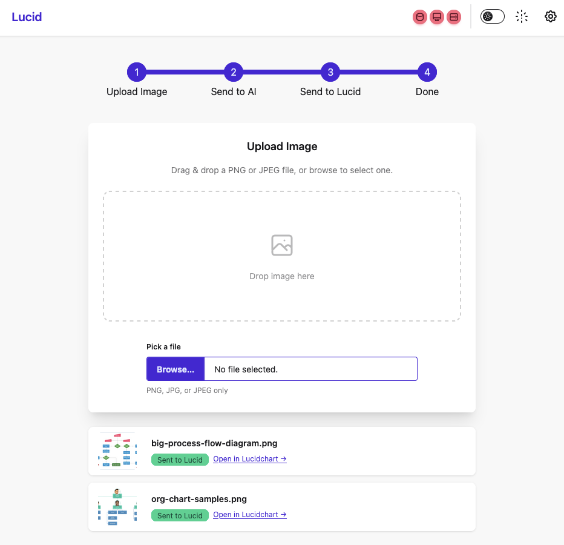

# Lucid v1.1.0


An image-to-Lucidchart pipeline built with **Flask**, **Couchbase Lite CE** (C edition), and **DaisyUI**. Upload images, AI analyzes them into diagram shapes and lines, then auto-imports into Lucidchart via the Standard Import API — all from a single Docker container.


---

## Features

- **Image optimization** — Automatic downscaling (max 1500px) and JPEG re-encoding before sending to AI, with toggleable Optimize Image control and real-time metadata preview (size, dimensions, est. tokens)
- **User-controlled pipeline** — Upload → review metadata → Process → AI → Lucid, with Cancel and Delete buttons
- **Multi-provider AI support** — Gemini (`gemini-2.0-flash`), OpenAI (`gpt-4o`), Claude (`claude-sonnet-4-20250514`), xAI/Grok (`grok-4.20-reasoning`)
- **Lucidchart Standard Import API** integration — creates diagrams automatically from AI analysis
- **Drag & drop / browse** image upload (PNG, JPEG, JPG)
- **Couchbase Lite CE** (C SDK + Python CFFI bindings) for local embedded storage — no external database required
- **Processing pipeline** with visual step tracker: Upload → AI → Lucid → Done
- **Debug console** — activated via `?debug=true`, with real-time log streaming, color-coded stages, and resend buttons
- **Image record tracking** — full lifecycle with timestamps, AI provider/model, duration, shape/line counts, error tracking
- **Live status indicators** — three circular buttons showing real-time health of CB Lite, AI API, and Lucid REST API
- **Image history** — paginated table (limit 10, offset-based) with thumbnails, status badges, and delete buttons
- **Light / Dark theme toggle** with localStorage persistence
- **Settings modal** — collapsible sections for all credentials and read-only timeout display
- **DaisyUI components** — navbar, file-input, steps, modal, toast, card, table, toggle, collapse, badge

---

## Architecture


---

## Quick Start

```bash
docker compose up --build
```

Open **http://localhost:8888**



---

## Project Structure

```
lucid/
├── app.py               # Flask server, API routes, CBL storage
├── test_app.py           # Unit tests
├── config.json          # Build/runtime settings (port, timeouts)
├── docker-compose.yml   # Docker Compose service definition
├── Dockerfile           # Multi-arch build with Couchbase Lite CE C
├── requirements.txt     # Python dependencies
├── README.md
└── static/
    ├── index.html       # Single-page UI (DaisyUI + Tailwind CSS CDN)
    └── help.html        # Help page
```

---

## Configuration

### `config.json` — Build-time settings

Edit this file and rebuild the container to apply changes.

| Key | Default | Description |
|---|---|---|
| `server.port` | `8888` | Port the Flask server listens on |
| `server.debug` | `true` | Enable Flask debug mode |
| `timeouts.ai_api` | `120` | Timeout (seconds) for AI API calls |
| `timeouts.lucid_api` | `15` | Timeout (seconds) for Lucid REST API calls |
| `ai_providers.*.base_url` | varies | Base URL for each AI provider |
| `ai_providers.*.timeout` | `30` | Per-provider timeout override |

### Runtime credentials (via Settings UI)

Click the ⚙️ gear icon in the top-right corner to configure:

- **Lucid REST API** — API key (Bearer token from lucid.app/developer)
- **Gemini** — API key
- **OpenAI** — API key
- **Claude** — API key
- **xAI (Grok)** — API key

Credentials are stored in the Couchbase Lite embedded database inside the container (persisted via Docker volume).

---

## API Endpoints

| Method | Path | Description |
|---|---|---|
| `GET` | `/` | Serves the UI |
| `GET` | `/help.html` | Serves the help page |
| `POST` | `/upload` | Upload an image file |
| `GET` | `/uploads/<filename>` | Serve an uploaded image |
| `GET` | `/api/images?limit=10&offset=0` | Paginated image history |
| `DELETE` | `/api/images/<doc_id>` | Delete an image record |
| `POST` | `/api/image-meta` | Get original/optimized image metadata (size, dimensions, tokens) |
| `POST` | `/api/process` | Send image to AI provider for analysis (accepts `optimize` flag) |
| `POST` | `/api/send-to-lucid` | Create Lucidchart document from AI result |
| `GET` | `/api/credentials` | Get saved API credentials |
| `POST` | `/api/credentials` | Save API credentials |
| `GET` | `/api/settings` | Get build config (read-only) |
| `GET` | `/api/status` | Health check: `{cbl, ai, lucid}` booleans |
| `GET` | `/api/cbl-stats` | Couchbase Lite statistics |
| `GET` | `/api/debug-log?since=<ts>` | Get debug log entries since timestamp |
| `DELETE` | `/api/debug-log` | Clear debug log |

---

## Status Indicators

Three circular buttons at the top of the page show live connectivity:

| Indicator | What it checks |
|---|---|
| **CB Lite** 🟢/🔴 | Can open the local Couchbase Lite database |
| **AI API** 🟢/🔴 | Reachability of the selected AI provider |
| **Lucid** 🟢/🔴 | Lucid REST API at `/documents` with saved API key |

Status is polled every 30 seconds.

---

## Storage

Lucid uses **Couchbase Lite Community Edition** (C library with Python CFFI bindings) as its embedded database. Data is stored in `/app/data/lucid_db/` inside the container and persisted via the `data` Docker volume.

**Documents stored:**

| Doc ID | Purpose |
|---|---|
| `credentials` | API keys and Lucid REST API key |
| `image_manifest` | JSON array of all image document IDs |
| `img_<timestamp>` | Individual image records |

**Image record fields (`img_<timestamp>`):**

| Field | Description |
|---|---|
| `filename` | Original filename |
| `timestamp` | Upload epoch timestamp |
| `status` | `uploaded` → `ai_processing` → `ai_done` → `lucid_sending` → `done` (or `error`) |
| `ai_provider` | Provider used (gemini, openai, claude, xai) |
| `ai_model` | Model name (e.g., `gpt-4o`) |
| `ai_sent_at` | Epoch time when AI request was sent |
| `ai_received_at` | Epoch time when AI response arrived |
| `ai_duration_s` | AI round-trip time in seconds |
| `ai_shapes` | Number of shapes extracted |
| `ai_lines` | Number of lines/connections extracted |
| `lucid_sent_at` | Epoch time when Lucid request was sent |
| `lucid_received_at` | Epoch time when Lucid response arrived |
| `lucid_duration_s` | Lucid round-trip time in seconds |
| `lucid_response` | Lucid API response body |
| `error_source` | `ai` or `lucid` (on error) |
| `error_detail` | Error message detail |

If Couchbase Lite is unavailable (e.g., local development without the C library), the app falls back to JSON file storage automatically.

---

## Debug Mode

Append `?debug=true` to the URL to enable the debug console.

- **Real-time log panel** with color-coded entries that polls every second
- **Resend to AI** / **Resend to Lucid** buttons for rapid iteration
- **Clear** and **auto-scroll** controls

**Stages:**

| Stage | Color | Description |
|---|---|---|
| `upload` | Info (blue) | Image upload events |
| `cbl-save` | Accent | Couchbase Lite save operations |
| `config` | Muted | Credential/config loading |
| `ai-request` | Warning (yellow) | Outbound AI API request |
| `ai-response` | Success (green) | AI response received |
| `ai-error` | Error (red) | AI processing failure |
| `lucid-request` | Warning (yellow) | Outbound Lucid API request |
| `lucid-response` | Success (green) | Lucid document created |
| `lucid-error` | Error (red) | Lucid API failure |

---

## Testing

```bash
python -m pytest test_app.py -v
```

---

## Changing the Port

1. Edit `config.json`:
   ```json
   { "server": { "port": 9999 } }
   ```
2. Update `docker-compose.yml`:
   ```yaml
   ports:
     - "9999:9999"
   ```
3. Rebuild:
   ```bash
   docker compose up --build
   ```

---

## Tech Stack

| Layer | Technology |
|---|---|
| Backend | Python 3.12, Flask, Pillow |
| Embedded DB | Couchbase Lite CE 3.2.1 (C SDK + CFFI) |
| Frontend | DaisyUI 5, Tailwind CSS 4 (CDN) |
| Container | Docker, Docker Compose |
| AI Providers | Gemini (`gemini-2.0-flash`), OpenAI (`gpt-4o`), Claude (`claude-sonnet-4-20250514`), xAI (`grok-4.20-reasoning`) |
| Diagram Platform | Lucidchart Standard Import API |

---

## License

Apache 2.0
